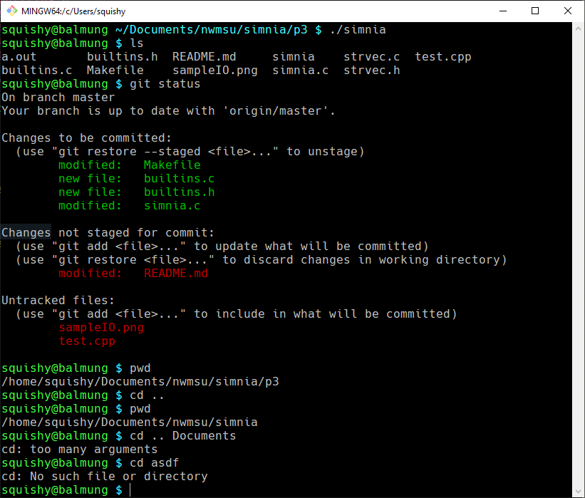

# Project 3: Executing commands

## Building your Shell, part 3 

## 44-550 Operating Systems

## 20 points

At this point we are ready to make our shell begin executing commands and creating built-in functionality.
This project will have you practicing the following skills/C functions:

* Process creation (`fork()`)
* Process execution (`exec*`)
* Function pointers

You will be responsible not only for the C source code for this project, but also the Makefile.
Your string vector code from the previous project will be very helpful here.
You will be creating an additional `.h/.c` file pair to contain the utility functions for this shell

There will not be automated testing for this assignment, as that would be hard.

### Milestones

| Milestone | Tests Passed |
| --- | --- |
| Implement basic execution (`fork` and `exec`) | Can run basic commands (like `ls -alh`)|
| Create `builtins.h` and `builtins.c` with comment headers (and modify `Makefile`) | |
| Implement `cd` built-in| `pwd` will show you can now change directories |

### Grading

| Criteria | Points Per Unit | Total Points |
| --- | --- | --- |
| At least one unique commit for each milestone | .5 / milestone | 1.5 |
| Commit messages describe what the commit is doing | .5 / milestone | 1.5 |
| Simple commands (`echo`, `ls`, `pwd`) work correctly   | | 4 |
| Shell allows running multiple commands | | 3 |
| `cd` changes directories (as verified by `pwd`)| | 2 |
| Shell runs commands without memory leaks | | 2 |
| New files have appropriate comment header | 1/file | 2 |
| Functions have appropriate function documentation |  | 1 |
| New files are formatted well and follow consistent coding standards (naming, spacing, etc) | | 3 |
| ***Total*** | | ***20***|

### Milestone and Function Descriptions

#### Milestone 1

Using the `execvp` function and `fork` to make your shell run functions; you will be modifying your `exec_cmd` function to do this.  For error handling you will need to `#include<errno.h>`.  Essentially, you should do the following:

```text
cpid = fork()
if we are in the child:
    if the result of execvp is -1:
        perror(strvec_get(*cmd, 0))
        exit(errno)
    else if there was an error in fork (cpid < 0):
        print an error message
    else:
        wait for the child to finish
```

Assuming you store the PID of the child in the variable `cpid`, you will need to do the following:

```c
int status;
pid_t wpid;

do {
    wpid = waitpid(cpid, &status, WUNTRACED);
} while (!WIFEXITED(status) && !WIFSIGNALED(status));
```
This code is essentially magic, but it ensures that the shell allows the child process to complete before it continues getting input.

After completing this milestone, you should be able to do the following:

```bash
make simnia
./simnia
```
You can then run basic commands! Things like `ls`, `git`, and other `pwd` should all work as intended.

### Milestone 2: `builtins.h` and `builtins.c`

Create these files with appropriate comment headers and header guards and modify your Makefile to compile the `.c` file when you run `make simnia`

### Milestone 3: `cd`

The `cd` command is not a binary but a built in bash function that wraps the `chdir` function (http://man7.org/linux/man-pages/man2/chdir.2.html).  We are going to set our shell up to easily extend it with builtin functionality by doing the following:

* Create an array of strings corresponding to the names of the builtin functions
* Create an array of function pointers that corresponds to the functionality of the specified string
* Before executing a command loop through the array of strings and see if it is one of the built in functions.

Creating the global array of strings and function pointers is tricky; we need to use the `extern` keyword to avoid multiply defined errors.  In my solution, I have decided that every built in function will be a C function that takes a `const strvec *`.  As such, I have the following contents in my `.h` file:

```c
extern const char* BUILTINS[];
void _cd(const strvec * cmd);
extern const void (*FCNS[])(const strvec * cmd);
```

My `.c` file includes the `.h` file, and in addition to the implementation of the `_cd` function contains the following:

```c
const char* BUILTINS[] = {"cd", NULL};
const void (*FCNS[])(const strvec * cmd) = {_cd, NULL};
```

This defines an array of strings called `BUILTINS` and an array of function pointers called `FCNS`).  If I have a `strvec *` called `cmd` and want to call the function at index 0 in the `FCNS` array, I can simply run `FCNS[i](c);`.

The `_cd` function should do the following:

```text
if the strvec has 3 or more elements in it:
    print an error that cd has too many arguments
else if the size of the command is 1:
    chdir to the home directory (use some google-fu to determine how to get the home directory)
else:
    if chdir(strvec_get(*cmd, 1)) == -1:
        perror("cd") // this will print a string message telling you what kind of error it is

```

### Sample IO

You will notice that I made my prompt `user@hostname` and used the same colors as my default prompt; the biggest difference is that I did not print the current working directory in the prompt.


